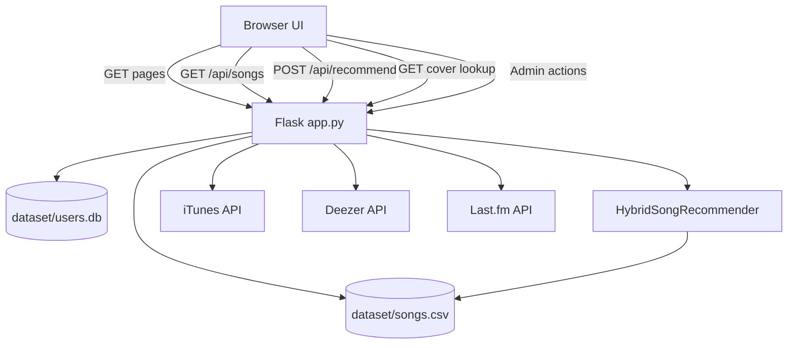

# Music Recommender Web Project Documentation

## 1. Project Overview

This project is a Flask-based web application that recommends songs similar to a selected seed track.
It combines a Python backend, a browser-based frontend, and a CSV-backed recommendation dataset.

The app is centered on a lightweight hybrid recommendation engine that blends four signals:

- vibe similarity from tempo, energy, danceability, genre, and mood
- artist similarity from parsed artist and collaborator tokens
- lyrics or text similarity from lyrics when present, otherwise from title, genre, and mood text
- collaborative similarity from simulated user listening interactions

The current application is not a streaming platform and does not persist full recommendation history on the server.
It is a recommendation demo with login support, dataset management tools, and client-side queue history.

## 2. Tech Stack

- Backend: Flask
- Data processing: pandas, numpy
- Machine learning: scikit-learn
- Frontend: HTML, CSS, JavaScript
- Auth storage: SQLite
- Dataset storage: CSV in dataset/songs.csv
- External metadata/data sources:
  - iTunes Search API for catalog generation and album art lookup
  - Last.fm API for dataset expansion
  - Deezer search as a fallback for cover artwork lookup

## 3. Project Structure

```text
music-recommender-web/
|-- app.py
|-- PROJECT_DOCS.md
|-- README.md
|-- requirements.txt
|-- dataset/
|   |-- songs.csv
|   `-- users.db
|-- recommender/
|   |-- model.py
|   |-- dataset_generator.py
|   |-- itunes_dataset_generator.py
|   `-- lastfm_dataset_generator.py
|-- static/
|   |-- app.js
|   `-- style.css
`-- templates/
    |-- admin.html
    |-- history.html
    |-- index.html
    |-- library.html
    `-- login.html
```

## 4. High-Level Architecture



## 5. Core Application Flow

### 5.1 Startup

When the server starts:

1. Flask initializes the app in app.py.
2. The SQLite database is initialized if it does not exist.
3. The recommender model is not built immediately.
4. The model is built lazily on the first request that needs song data or recommendations.

This lazy-loading pattern keeps app startup simple, but the first recommendation-related request may take longer because matrices are created at that point.

### 5.2 User Flow

1. A user signs up or logs in.
2. The Home page loads.
3. The frontend calls GET /api/songs to populate the searchable song list.
4. The user picks a seed song and a similarity mode.
5. The frontend sends POST /api/recommend with song_id, top_n, and similarity_mode.
6. The backend queries the in-memory recommender and returns recommendation results.
7. The frontend renders cards, insights, context metrics, and optional saved queue state in localStorage.

## 6. Backend Design

### 6.1 app.py responsibilities

app.py acts as the main composition layer. It handles:

- Flask app setup
- session-based authentication
- SQLite user persistence
- lazy construction and reset of the recommender instance
- page routes for login, home, library, history, and admin screens
- JSON API routes for songs, recommendations, covers, and admin actions

### 6.2 Authentication

Authentication is server-side and session-based.

- Users are stored in dataset/users.db.
- Passwords are hashed with Werkzeug.
- Session state stores the username after login.
- Most app pages and APIs are protected by decorators.

Important behavior:

- /login and /signup are public.
- /, /library, /history, and /admin require login.
- /api/songs, /api/recommend, and admin APIs require login.
- /api/cover and /api/cover-image are public in the current implementation.

### 6.3 Model lifecycle

The recommender instance is cached in a module-level variable.

- get_recommender() creates it only once when first needed.
- reset_recommender() clears the cache.
- Admin model reload only clears the cache; the next request rebuilds the model.

This means dataset changes do not affect results until the cache is cleared or the app restarts.

## 7. Recommendation Engine

The model is implemented in recommender/model.py as HybridSongRecommender.

### 7.1 Required dataset columns

The model expects these columns:

- song_id
- title
- artist
- genre
- tempo
- energy
- danceability
- mood

The loader also supports a few compatibility behaviors:

- if title is missing but song exists, song is renamed to title
- if song_id is missing, stable sequential ids are generated
- if mood is missing but valence exists, mood is derived from valence
- if lyrics does not exist, the model falls back to title + genre + mood text

### 7.2 Similarity modes

The recommender supports five modes:

- hybrid
- artist
- lyrics
- vibe
- collaborative

How each mode works:

- vibe: cosine similarity over scaled numeric features plus one-hot genre and mood vectors
- artist: cosine similarity over collaborator token vectors built with MultiLabelBinarizer
- lyrics: cosine similarity over TF-IDF features from lyrics or text fallback fields
- collaborative: cosine similarity over a simulated user-song interaction matrix
- hybrid: weighted blend of vibe, artist, lyrics, and collaborative scores

Hybrid weights:

- vibe: 0.35
- artist: 0.20
- lyrics: 0.25
- collaborative: 0.20

### 7.3 Collaborative signal note

The collaborative mode is not based on real user listening data.
It is generated from simulated listening events using random users with genre and mood affinities.

That makes it useful for demo behavior, but it should not be treated as a real collaborative filtering system.

## 8. Frontend Design

### 8.1 Main page

The main page in templates/index.html is a dashboard-like interface with:

- top navigation
- sidebar actions
- seed selection form
- similarity mode selector
- hero area for the current seed song
- recommendation result cards
- insights and context panels
- quick actions like Surprise Me and Use Last Seed

### 8.2 Client-side behavior

static/app.js handles the interactive flow:

- loads songs from the API
- resolves the selected song from typed input or exact labels
- submits recommendation requests
- renders recommendation cards and confidence bars
- fetches album covers from iTunes directly from the browser
- stores recent seeds and saved queues in localStorage
- replays saved recommendation runs

### 8.3 Persistence boundaries

There are two types of persistence in this app:

- server persistence:
  - user accounts in SQLite
  - songs dataset in CSV
- browser persistence:
  - saved queues in localStorage
  - recent seeds in localStorage

This split matters because queue history is per-browser, not shared across users or machines.

## 9. Pages and Their Roles

### 9.1 Login and signup

templates/login.html serves both login and signup modes.
It validates basic credential requirements and shows server-side auth errors.

### 9.2 Home

templates/index.html is the primary product page where recommendations are generated.

### 9.3 Library

templates/library.html is an informational screen.
It is not a full media library. It shows:

- current catalog count from GET /api/songs
- recommendation mode strategy guidance
- quick navigation back to the main recommendation experience

### 9.4 History

templates/history.html shows recent seed songs from browser localStorage.
It does not read recommendation history from the server.

### 9.5 Admin

templates/admin.html provides maintenance tools:

- live dataset stats
- model cache reset
- dataset expansion through Last.fm

## 10. API Reference

### 10.1 GET /api/songs

Returns the catalog used by the frontend for song search.

Response shape:

```json
{
  "songs": [
    {
      "song_id": 1,
      "title": "Blinding Lights",
      "artist": "The Weeknd",
      "genre": "Pop"
    }
  ]
}
```

### 10.2 POST /api/recommend

Request body:

```json
{
  "song_id": 123,
  "top_n": 10,
  "similarity_mode": "hybrid"
}
```

Response shape:

```json
{
  "source_song_id": 123,
  "similarity_mode": "hybrid",
  "count": 10,
  "recommendations": [
    {
      "title": "Example Song",
      "artist": "Example Artist",
      "genre": "Pop",
      "tempo": 118,
      "similarity_percent": 87.4
    }
  ]
}
```

Validation behavior:

- missing song_id returns 400
- non-integer song_id returns 400
- invalid top_n returns 400
- unsupported similarity_mode returns 400
- unknown song_id returns 404

### 10.3 GET /api/cover

Looks up a cover URL for a song title and artist.
It tries iTunes first, then Deezer, then falls back to a generated SVG cover.

### 10.4 GET /api/cover-image

Returns the actual image bytes or SVG fallback so the app can display a resolved cover image through the backend.

### 10.5 GET /api/admin/stats

Returns dataset and user metrics:

- row count
- unique genres
- unique artists
- last updated timestamp
- file size in MB
- user count

### 10.6 POST /api/admin/reload-model

Clears the cached recommender so it rebuilds on next access.

### 10.7 POST /api/admin/expand-dataset

Expands the dataset using Last.fm.

Request body:

```json
{
  "target_size": 1000
}
```

Requirement:

- server environment variable LASTFM_API_KEY must be set

## 11. Dataset Generation Scripts

### 11.1 recommender/dataset_generator.py

Creates a synthetic starter dataset from a hardcoded library of songs and genres.
This is the simplest offline dataset source and is useful for demos or resets.

### 11.2 recommender/itunes_dataset_generator.py

Builds a larger dataset from iTunes Search API results.

Key behavior:

- no API key required
- searches multiple genre and era terms
- deduplicates by title + artist
- synthesizes tempo, energy, danceability, and mood from genre profiles
- supports append mode to grow an existing dataset

### 11.3 recommender/lastfm_dataset_generator.py

Builds or expands the dataset from Last.fm top tracks by tag.

Key behavior:

- requires a Last.fm API key
- uses popular tag terms for variety
- deduplicates by title + artist
- synthesizes numeric features and mood from tag-based genre profiles
- supports append mode

## 12. How To Run The Project

### 12.1 Install dependencies

```powershell
pip install -r requirements.txt
```

### 12.2 Start the app

```powershell
python app.py
```

By default Flask will run on:

```text
http://127.0.0.1:5000
```

### 12.3 Optional: expand the dataset from iTunes

```powershell
python recommender/itunes_dataset_generator.py --target-size 3000
```

Append only new tracks:

```powershell
python recommender/itunes_dataset_generator.py --target-size 1000 --append
```

### 12.4 Optional: expand the dataset from Last.fm

PowerShell example:

```powershell
$env:LASTFM_API_KEY="your_api_key"
python recommender/lastfm_dataset_generator.py --api-key $env:LASTFM_API_KEY --target-size 8000 --append
```

## 13. Data and Storage Summary

### 13.1 Files written by the app

- dataset/songs.csv: music catalog and model features
- dataset/users.db: local user account database

### 13.2 Cache and transient state

- in-memory recommender instance in app.py
- browser localStorage for recent seeds and saved queues

## 14. Current Strengths

- simple deployment model with minimal infrastructure
- clear separation between UI, API, and recommendation logic
- multiple recommendation modes are easy to demo and compare
- dataset can be expanded from public APIs
- auth and admin tools already exist

## 15. Current Limitations

- Flask secret key is hardcoded and should be moved to environment configuration
- collaborative recommendations are simulated rather than based on real user events
- recommendation history is not stored on the server
- cover art fetching depends on external services and network availability
- model rebuild happens in-process and may become slower as dataset size grows
- SQLite and CSV are fine for local development but limited for multi-user production use

## 16. Recommended Next Improvements

If you want to grow this project beyond demo scope, the most useful next steps are:

1. Move secrets and runtime configuration to environment variables.
2. Persist recommendation history and saved queues in the database.
3. Add tests for routes, auth, and recommender behavior.
4. Store real user interactions and replace simulated collaborative signals.
5. Add pagination or search endpoints for large catalogs.
6. Split app.py into smaller modules for auth, API routes, and admin services.

## 17. Short Explanation For Presentation Use

This project is a Flask music recommendation web app that lets authenticated users choose a song and receive similar tracks using multiple similarity strategies. The backend reads a CSV-based song dataset, builds several similarity matrices, and exposes recommendation and admin APIs. The frontend renders an interactive dashboard, stores queue history in browser localStorage, and supports dataset growth through iTunes and Last.fm data sources.