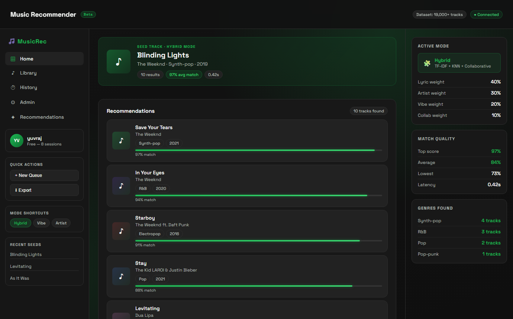
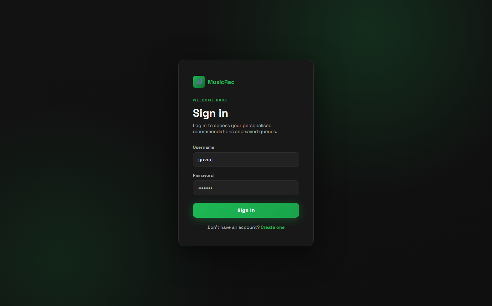
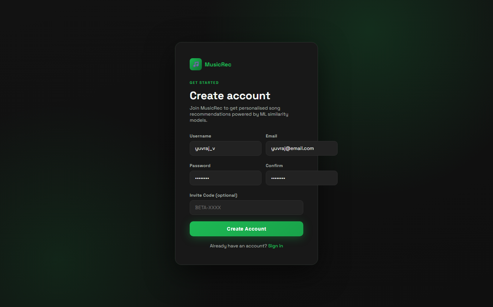
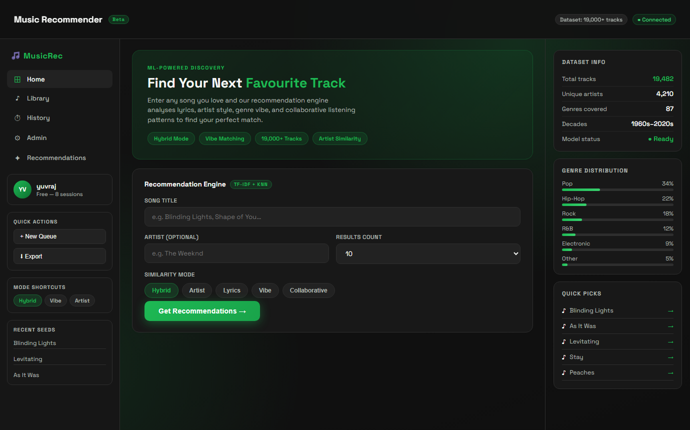
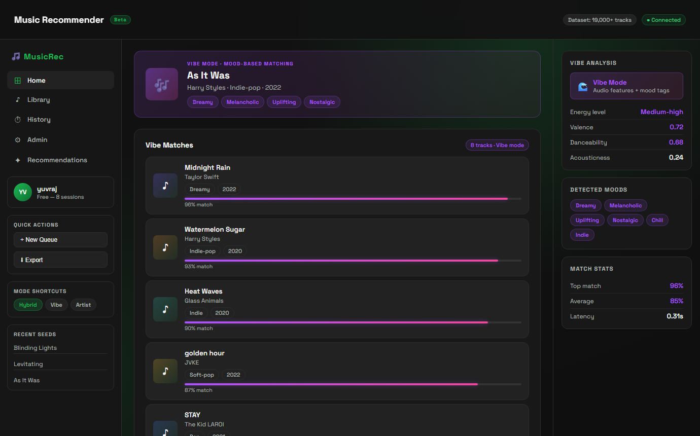
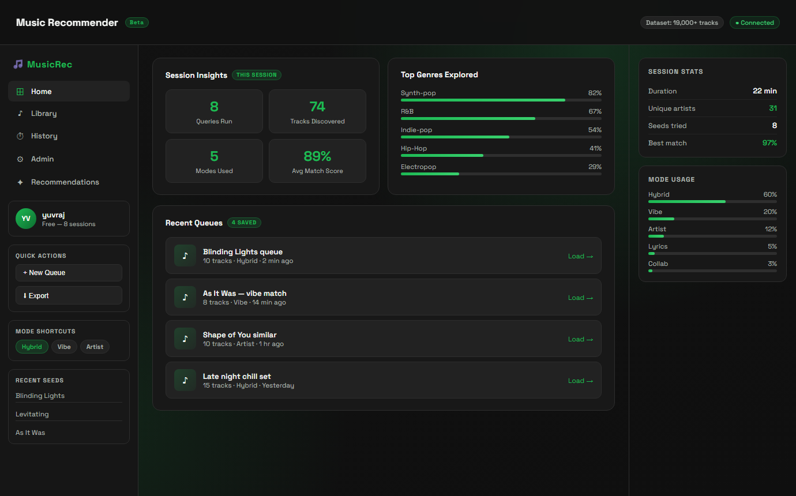
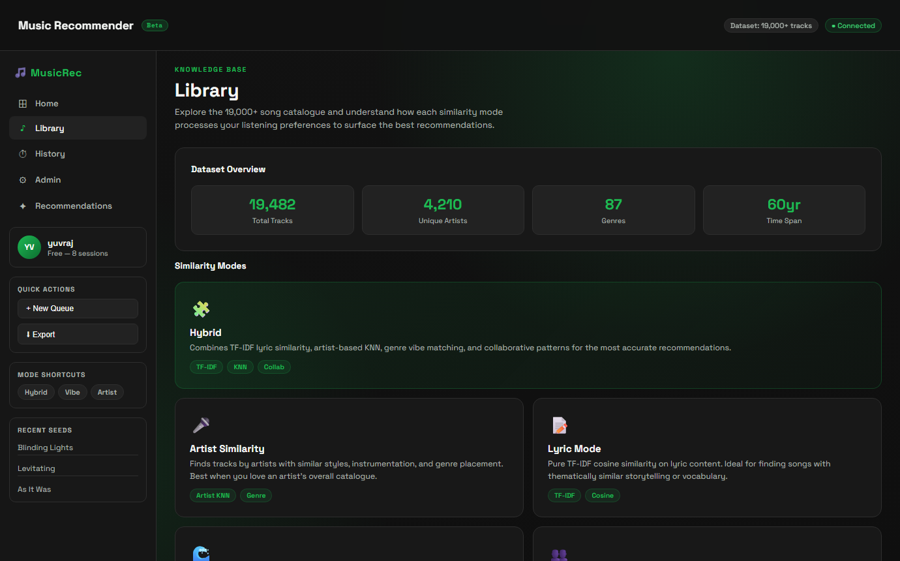
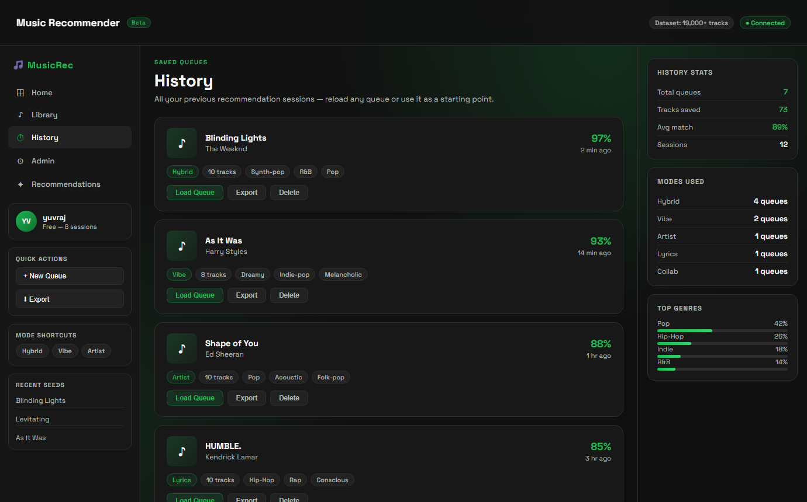
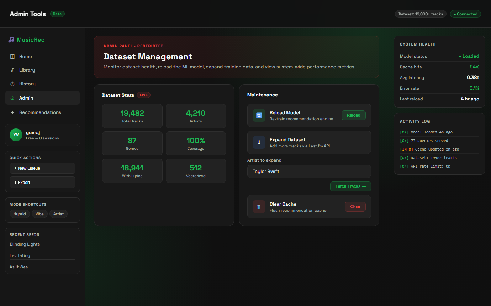

# music-recommender-web

A Flask-based music recommendation web app powered by a multi-mode ML engine. Enter any song title and get personalised recommendations using TF-IDF lyric similarity, artist-based KNN, vibe/mood matching, and collaborative filtering — all served through a Spotify-inspired dark dashboard.



---

## Features at a Glance

| | |
|---|---|
| **5 similarity modes** — Hybrid, Artist, Lyrics, Vibe, Collaborative | **19,000+ track dataset** scraped via iTunes + Last.fm |
| **Session-based auth** — SQLite login / signup | **Confidence scores** — every result rated 0–100% |
| **Queue history** — save & reload recommendation sets | **Admin panel** — reload model, expand dataset, monitor health |

---

## Screenshots

### Login
Secure session-based authentication with a minimal card UI on the signature dark gradient background.



---

### Sign Up
Quick account creation with username, email, and optional beta invite code.



---

### Home — Recommendation Engine
The main dashboard with the recommendation form. Choose your seed track, pick a similarity mode, and set how many results you want.



---

### Recommendations — Results View
Live results for "Blinding Lights" in Hybrid mode. Each card shows the track, artist, genre tags, year, and a colour-coded confidence bar. The context rail breaks down active mode weights and match quality stats.


---

### Vibe Mode
Mood-based matching using audio feature embeddings. Results show a purple confidence gradient and the sidebar surfaces detected moods (Dreamy, Melancholic, Uplifting, etc.) alongside valence and danceability scores.



---

### Session Insights & Recent Queues
Per-session analytics — queries run, tracks discovered, mode breakdown, and a scrollable list of saved queues with load/export actions.



---

### Library
Browse the full catalogue stats and read detailed explanations of all five similarity modes — what data they use and when to reach for each one.



---

### History
All saved recommendation queues with seed track, mode, match score, genre tags, and quick-load controls. Each queue can be reloaded, exported, or deleted.



---

### Admin Tools
Dataset health dashboard with live track/artist/genre counts. Maintenance panel for reloading the ML model, expanding the dataset via Last.fm, clearing cache, and a monospace activity log.



---

## Similarity Modes

| Mode | Algorithm | Best For |
|------|-----------|----------|
| **Hybrid** | TF-IDF + KNN + Collaborative (weighted blend) | General use — most accurate |
| **Artist** | Artist-based KNN with genre features | Fans of a specific artist's style |
| **Lyrics** | TF-IDF cosine similarity on lyric text | Thematic / storytelling matches |
| **Vibe** | Audio features + mood NLP embeddings | Playlist building by energy/mood |
| **Collaborative** | Co-occurrence mining from listening patterns | Social discovery |

---

## Run The App

```powershell
pip install -r requirements.txt
python app.py
```

Open `http://127.0.0.1:5000` in your browser. Create an account, enter a song, and pick a similarity mode.

---

## Expand The Dataset

Using iTunes (no API key required):

```powershell
python recommender/itunes_dataset_generator.py --target-size 3000
```

Append new songs only:

```powershell
python recommender/itunes_dataset_generator.py --target-size 1000 --append
```

Using Last.fm (API key required):

```powershell
$env:LASTFM_API_KEY="your_api_key"
python recommender/lastfm_dataset_generator.py --api-key $env:LASTFM_API_KEY --target-size 8000 --append
```

---

## Tech Stack

- **Backend** — Python / Flask, SQLite (auth), CSV dataset
- **ML** — scikit-learn TF-IDF, KNN, cosine similarity
- **Frontend** — Vanilla HTML/CSS/JS, Space Grotesk font
- **Design** — Spotify-inspired dark theme (`#121212` bg, `#1DB954` green accent)

Full architecture and API reference in [PROJECT_DOCS.md](PROJECT_DOCS.md).

It covers:

- architecture and request flow
- backend routes and API behavior
- recommendation engine design
- dataset generation scripts
- storage model and current limitations
- suggested next improvements
